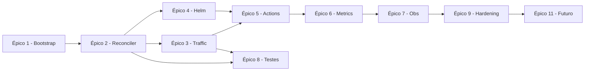

# Kanary Operator — Backlog (GitHub Project-ready)

> Este arquivo descreve **épicos, milestones e issues** prontos para importar em um GitHub Project.
> Ele é a versão humana do backlog. Para import automatizado use o `issues.csv` anexo.

## Milestones

| Milestone                  | Data alvo    | Objetivo                                                      |
|----------------------------|--------------|----------------------------------------------------------------|
| M0 — Spec & Scaffold       | Semana 1     | Repositório criado, `SPEC.md`, scaffold do operador.          |
| M1 — MVP Manual            | Semanas 2–5  | Canary manual + Nginx + Helm chart + CI + unit/envtest.       |
| M2 — Multi-provider        | Semanas 6–8  | Openshift Routes + E2E EKS/AKS/OCP + docs operação.           |
| M3 — Progressive Analysis  | Semanas 9–11 | Modo Progressive + Prometheus/Datadog/Dynatrace + alertas.    |
| M4 — Hardening & 1.0       | Semanas 12–13| Benchmarks, SBOM, cosign, security review, release 1.0.       |
| M5 — Blue/Green (futuro)   | v1.1+        | Nova estratégia BlueGreen + shadow + A/B testing.             |

## Labels

- **area/** `controller`, `traffic`, `metrics`, `analysis`, `webhooks`, `chart`, `ci`, `docs`, `testing`, `perf`, `security`
- **kind/** `feature`, `bug`, `chore`, `docs`, `refactor`, `test`
- **priority/** `p0`, `p1`, `p2`, `p3`
- **good-first-issue**, `help-wanted`, `blocked`, `needs-triage`

---

## Épico 1 — Bootstrapping (M0)

- [ ] **#001** Criar repositório `kanary` com licença Apache 2.0, CODEOWNERS, CONTRIBUTING. _(area/docs, priority/p0)_
- [ ] **#002** Scaffold com `kubebuilder init --domain kanary.io --repo github.com/<org>/kanary`. _(area/controller, priority/p0)_
- [ ] **#003** Criar tipo `Canary` v1alpha1 (`kubebuilder create api --group kanary --version v1alpha1 --kind Canary`). _(area/controller)_
- [ ] **#004** Commit do `SPEC.md` + `BACKLOG.md` + `docs/adr/001-no-replace-deployment.md`. _(area/docs)_
- [ ] **#005** Setup `Makefile` com targets: `build`, `test`, `lint`, `manifests`, `docker-build`, `helm-lint`. _(area/ci)_
- [ ] **#006** `golangci-lint` config (`.golangci.yml`) + pre-commit hooks. _(area/ci)_
- [ ] **#007** Bootstrap GitHub Project + importar issues via `issues.csv`. _(area/docs, priority/p0)_

## Épico 2 — Core Reconciler (M1)

- [ ] **#010** Definir types `CanarySpec`, `CanaryStatus`, conditions enum. _(area/controller, priority/p0)_
- [ ] **#011** Validation webhook: `targetRef` aponta para Deployment existente; `steps` monotônicos. _(area/webhooks)_
- [ ] **#012** Defaulting webhook: `strategy.mode=Manual`, `analysis.enabled=false`. _(area/webhooks)_
- [ ] **#013** Implementar máquina de estados Idle→Progressing→Awaiting/Succeeded/RolledBack. _(area/controller, priority/p0)_
- [ ] **#014** Criar/gerenciar Deployment canary (cópia do stable, 1 réplica). _(area/controller)_
- [ ] **#015** Criar/gerenciar Services stable/canary. _(area/controller)_
- [ ] **#016** Suportar annotations `promote`, `abort`, `paused`, `canary-enabled`. _(area/controller, priority/p0)_
- [ ] **#021** Annotation `kanary.io/weight` para override do peso do step atual enquanto canary está em Progressing. _(area/controller, priority/p1)_
- [ ] **#017** Emitir K8s Events em cada transição. _(area/controller)_
- [ ] **#018** Logging estruturado com `log/slog`. _(area/controller)_
- [ ] **#019** Leader election opcional (`--enable-leader-election`). _(area/controller)_
- [ ] **#020** Flag `--watch-namespaces` (cluster/list/single). _(area/controller, priority/p0)_

## Épico 3 — Traffic Providers (M1 & M2)

- [ ] **#030** Interface `TrafficRouter` + factory por tipo. _(area/traffic, priority/p0)_
- [ ] **#031** Implementar `NginxIngressRouter` (annotations canary/weight/header). _(area/traffic, priority/p0)_
- [ ] **#032** Unit tests `NginxIngressRouter` (table-driven). _(area/testing)_
- [ ] **#033** Implementar `OpenshiftRouteRouter` (alternateBackends). _(area/traffic)_
- [ ] **#034** Unit tests `OpenshiftRouteRouter`. _(area/testing)_
- [ ] **#035** Detecção automática de provider disponível no cluster (`preferred-provider` auto). _(area/traffic, priority/p2)_
- [ ] **#036** Docs de instalação por provider. _(area/docs)_

## Épico 4 — Helm Chart (M1)

- [ ] **#040** Scaffold chart em `charts/kanary` com templates para CRDs, Deployment, RBAC, Service, ServiceMonitor, PrometheusRule. _(area/chart, priority/p0)_
- [ ] **#041** Values para `scope.mode` (`cluster|namespaced|multi-namespace`). _(area/chart)_
- [ ] **#042** Values para providers (traffic/metrics enable flags). _(area/chart)_
- [ ] **#043** `helm lint` + `helm test` no CI. _(area/ci, area/chart)_
- [ ] **#044** Publicar chart via GH Pages em cada tag. _(area/ci, area/chart)_

## Épico 5 — GitHub Actions (M1 & M2)

- [ ] **#050** Workflow `ci.yaml` (lint + test + race + coverage ≥80%). _(area/ci, priority/p0)_
- [ ] **#051** Workflow `e2e-kind.yaml` (kind + Nginx + envtest). _(area/ci, priority/p0)_
- [x] **#052** Workflow `release.yaml` (multi-arch build, GHCR, chart publish, SBOM+cosign). _(area/ci)_
- [ ] **#053** Composite action `canary-deploy` (v1 — manual). _(area/ci, priority/p0)_
- [ ] **#054** Composite action `standard-deploy` com toggle `enable-canary`. _(area/ci, priority/p0)_
- [ ] **#055** Docs de uso das actions em `docs/actions.md`. _(area/docs)_

## Épico 6 — Metric Providers & Analysis (M3)

- [x] **#060** Interface `MetricProvider` + factory. _(area/metrics, priority/p0)_
- [x] **#061** Implementar `PrometheusProvider` (PromQL + HTTP API). _(area/metrics, priority/p0)_
- [ ] **#062** Implementar `DatadogProvider` (Metrics v2 API + auth via Secret). _(area/metrics)_
- [ ] **#063** Implementar `DynatraceProvider` (Metrics v2 API + token). _(area/metrics)_
- [x] **#064** Engine de análise (janelas, thresholds min/max, consecutive fails). _(area/analysis, priority/p0)_
- [x] **#065** Modo Progressive no reconciler. _(area/controller, priority/p0)_
- [x] **#066** Rollback automático quando `maxFailedChecks` atingido. _(area/controller, priority/p0)_
- [ ] **#067** Fuzz tests dos parsers de query. _(area/testing)_

## Épico 7 — Observabilidade (M3)

- [x] **#070** Registrar métricas Prometheus descritas no SPEC §9.2. _(area/metrics, priority/p0)_
- [x] **#071** `ServiceMonitor` no chart. _(area/chart)_
- [x] **#072** `PrometheusRule` com alertas §9.5. _(area/chart)_
- [x] **#073** Dashboard Grafana em `docs/dashboards/kanary.json`. _(area/docs)_
- [ ] **#074** Flag `--otel-exporter` (stub para M5+). _(area/controller, priority/p3)_

## Épico 8 — Testes (transversal)

- [ ] **#080** Unit tests com cobertura ≥80% em todos os pacotes `internal/`. _(area/testing, priority/p0)_
- [ ] **#081** Envtest suite para reconciler (happy path manual). _(area/testing, priority/p0)_
- [ ] **#082** Envtest suite para reconciler progressivo + análise. _(area/testing)_
- [ ] **#083** E2E kind: manual happy path + toggle. _(area/testing)_
- [ ] **#084** E2E EKS manual (workflow_dispatch). _(area/testing)_
- [ ] **#085** E2E AKS manual. _(area/testing)_
- [ ] **#086** E2E Openshift manual. _(area/testing)_
- [ ] **#087** Benchmarks do reconciler + gate de regressão no CI. _(area/testing, area/perf)_

## Épico 9 — Segurança & Hardening (M4)

- [x] **#090** Pod security context restrito; `nonroot`, `readOnlyRootFilesystem`. _(area/security, priority/p0)_
- [x] **#091** RBAC mínimo por escopo. _(area/security, priority/p0)_
- [ ] **#092** SBOM (syft) + assinatura cosign no `release.yaml`. _(area/security)_
- [ ] **#093** Auditoria de dependências (`govulncheck`) em CI. _(area/security)_
- [ ] **#094** Threat model em `docs/security/threat-model.md`. _(area/security, area/docs)_

## Épico 10 — Documentação (transversal)

- [ ] **#100** README com quickstart (instalar + primeiro canary em 5 minutos). _(area/docs, priority/p0)_
- [ ] **#101** `docs/design.md` citando capítulos 7–11 do Go in Action 2nd Ed. _(area/docs)_
- [ ] **#102** `docs/api-reference.md` gerado a partir dos types (`crd-ref-docs`). _(area/docs)_
- [ ] **#103** `docs/troubleshooting.md`. _(area/docs)_
- [ ] **#104** `docs/upgrade-guide.md` (política de apiVersion). _(area/docs)_
- [ ] **#105** Website estático (MkDocs Material) publicado em GH Pages. _(area/docs, priority/p2)_

## Épico 11 — Futuro / Blue-Green (M5)

- [ ] **#110** RFC `strategy.mode: BlueGreen`. _(area/docs, priority/p2)_
- [ ] **#111** Shadow traffic (mirror) como step opcional. _(kind/feature)_
- [ ] **#112** A/B testing com header-based routing. _(kind/feature)_
- [ ] **#113** Suporte a `StatefulSet` target (spike). _(kind/feature)_
- [ ] **#114** Istio provider plugin. _(area/traffic, kind/feature)_

---

## Dependências entre Épicos

