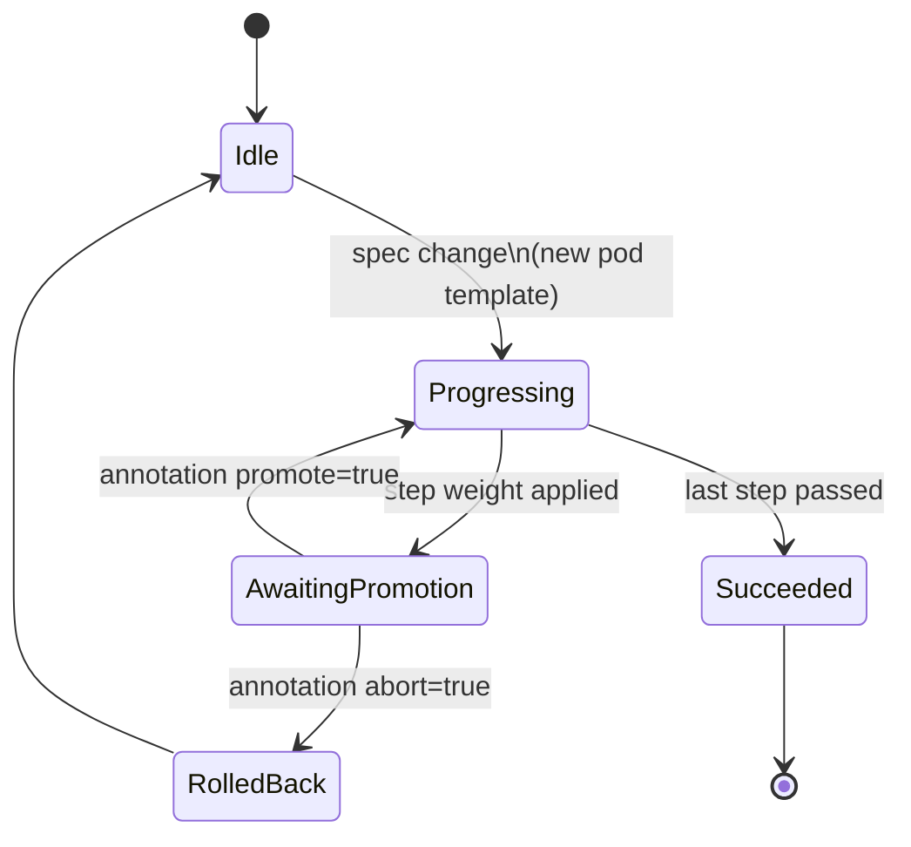
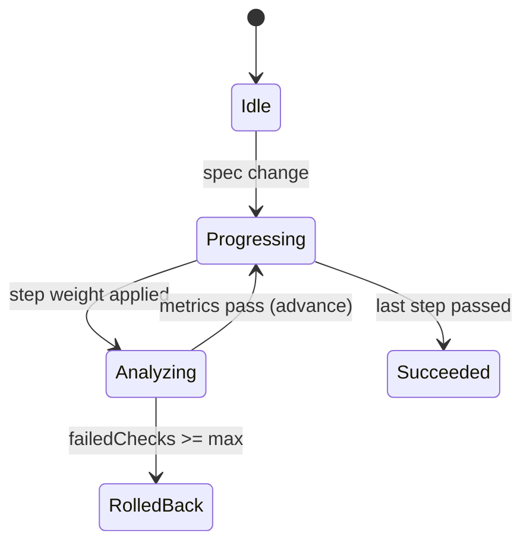
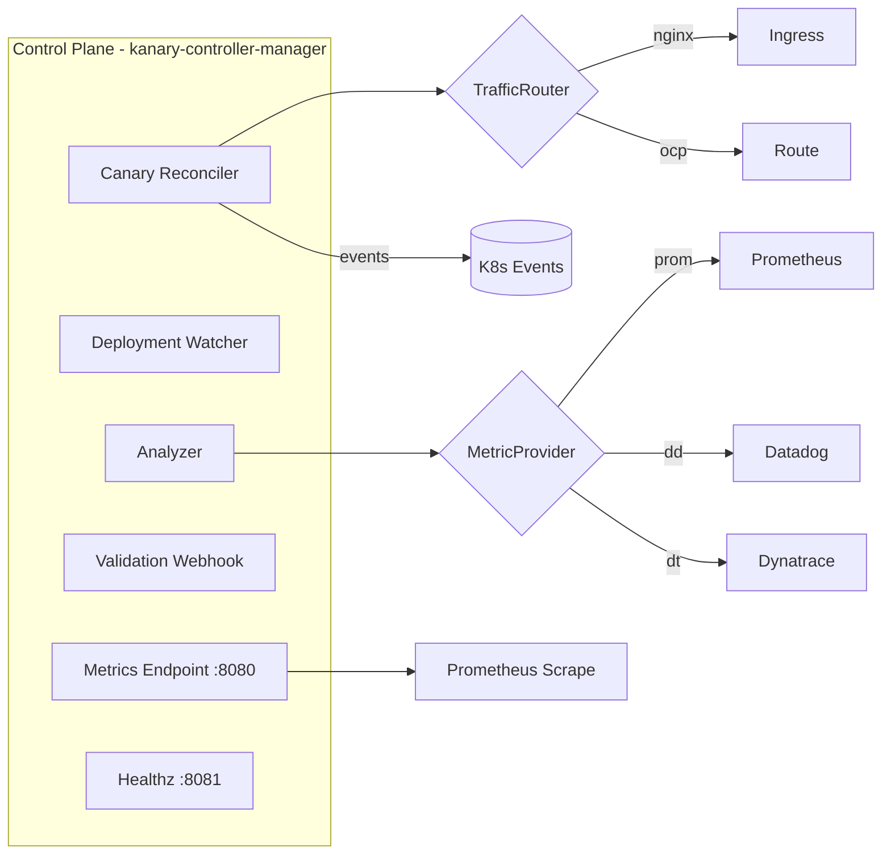

# Kanary Operator — Specification (SPEC)

> **Status:** Draft v0.1 · **Owner:** Adriano Pavão · **Data:** 2026-04-18
> **Scope:** Kubernetes Operator para Canary Deployments simplificado, com suporte multi-cloud (EKS, AKS, Openshift), análise de métricas opcional e integração CI/CD via GitHub Actions.
> **Base de design:** *Go in Action, 2nd Ed. (MEAP v10)* — capítulos 7 (Errors), 8 (Testing & Tooling), 9 (Concurrency), 11 (Larger Projects).

---

## 0. Sumário Executivo / Executive Summary

**PT-BR.** O **Kanary Operator** é um Kubernetes Operator escrito em Go, cujo objetivo é oferecer canary deployments **simples, previsíveis e multi-cloud**. Inspira-se no Flagger, mas reduz complexidade operacional tratando apenas `Deployments` padrão do Kubernetes, com rollout **manual por padrão** (via annotation) e rollout **progressivo opcional** guiado por métricas (Prometheus, Datadog, Dynatrace). Pode ser instalado via Helm em escopo *namespaced*, *lista de namespaces* ou *cluster-wide*, e é ativado/desativado por pipeline através de uma GitHub Action dedicada.

**EN.** **Kanary Operator** is a Go-based Kubernetes Operator that delivers **simple, predictable, multi-cloud** canary deployments. Inspired by Flagger but intentionally narrower in scope: works only with vanilla `Deployments`, defaults to **manual promotion** via annotation, and offers optional **progressive rollout** driven by metric analysis (Prometheus, Datadog, Dynatrace). Helm-installable in namespaced, multi-namespace, or cluster-wide scope, with dedicated GitHub Actions for canary and standard deploys.

---

## 1. Requisitos / Requirements Matrix

| #  | Requisito (PT)                                                                               | Requirement (EN)                                                                          | Seção |
|----|-----------------------------------------------------------------------------------------------|--------------------------------------------------------------------------------------------|-------|
| 1  | Trabalhar apenas com `Deployments` padrão K8s                                                 | Work exclusively with stock Kubernetes `Deployments`                                       | §3.1  |
| 2  | Traffic providers: Nginx Ingress (community) e Openshift Routes; portável para EKS/AKS/OCP   | Traffic providers for Nginx Ingress & Openshift Routes; portable across EKS/AKS/OCP        | §4.2  |
| 3  | Rollout **manual** padrão via annotation; progressivo opt-in via CR                           | **Manual** rollout by default (annotation); progressive rollout opt-in via CR              | §4.3  |
| 4  | Análise de métricas opt-in (Dynatrace, Datadog, Prometheus) para promote/rollback automático | Opt-in metric analysis (Dynatrace, Datadog, Prometheus) for automated promote/rollback     | §4.4  |
| 5  | Instalação via Helm; GitHub Actions para canary deploy **e** deploy normal                   | Helm-installable; GitHub Actions for both canary and standard deploys                      | §6, §7|
| 6  | Liga/desliga canary direto na esteira                                                         | Toggle canary on/off from the pipeline                                                     | §7.3  |
| 7  | Operador K8s com melhores práticas de engenharia de software                                  | K8s Operator built with software engineering best practices                                | §5    |
| 8  | Baixo consumo de memória; escopo namespaced/lista/cluster                                     | Low memory footprint; namespaced/list/cluster scope                                        | §8    |
| 9  | Observabilidade e alertas embutidos                                                           | Built-in observability and alerting                                                        | §9    |
| 10 | Usar *Go in Action 2nd Ed.* como base                                                         | Use *Go in Action 2nd Ed.* as design baseline                                              | §5.1  |
| 11 | Testes unitários + integração (Docker Desktop, EKS, AKS, Openshift)                          | Unit + integration tests (Docker Desktop, EKS, AKS, Openshift)                             | §10   |
| 12 | Especificação salva em `.md` versionada                                                       | Specification stored as versioned `.md`                                                    | este arquivo |
| 13 | GitHub Projects com backlog; expansibilidade (Blue/Green futuro)                             | GitHub Projects backlog; future expandability (Blue/Green, etc.)                           | §12   |

---

## 2. Visão de Produto / Product Vision

### 2.1 Problema (PT)

Soluções existentes de canary deployment (Flagger, Argo Rollouts) são poderosas, porém exigem:
- CRDs próprios (`Rollout`, `Canary`) que substituem ou envolvem `Deployments`;
- Service Mesh ou pré-requisitos complexos;
- Conhecimento especializado para tuning;
- Equipes pagam o custo de complexidade mesmo quando não precisam de progressivo.

### 2.2 Proposta de Valor

- **Mínimo atrito** com o ecossistema: só `Deployments` + `Service` + `Ingress/Route`.
- **Segurança por padrão:** promoção manual; progressivo é escolha explícita.
- **Portabilidade real:** a mesma CR roda em EKS, AKS e Openshift.
- **Enxuto:** single binary, single chart, baixa memória.
- **Observável:** Prometheus metrics, Kubernetes Events, alertas prontos.

### 2.3 Personas

| Persona            | Necessidade principal                                              |
|--------------------|---------------------------------------------------------------------|
| SRE/Platform Eng   | Instalar, escalar e monitorar o operador em múltiplos clusters.    |
| Dev/Release Eng    | Publicar release via GitHub Action sem aprender novos CRDs pesados.|
| Engineering Mgr    | Ver status agregado de rollouts e alertas de falha.                 |
| Compliance/SecOps  | Auditoria de promoções e rollbacks via Events e Prometheus.        |

---

## 3. Escopo / Scope

### 3.1 Dentro do Escopo

1. Reconciliar recurso `Canary` que **referencia** um `Deployment` existente.
2. Criar/gerenciar objetos auxiliares (stable/canary services, backend split em Ingress/Route).
3. Executar rollout manual (padrão) ou progressivo (opt-in).
4. Executar análise opcional via Prometheus/Datadog/Dynatrace.
5. Expor métricas, eventos e logs estruturados.
6. Prover Helm chart para instalação e `PrometheusRule` com alertas.
7. Prover GitHub Actions prontas para `canary-deploy` e `standard-deploy`.
8. Suportar escopo `namespaced`, `multi-namespace` e `cluster-wide` via flags.

### 3.2 Fora do Escopo (v1)

- Service Mesh (Istio, Linkerd) — adicionar via plugin futuro (v2).
- Blue/Green, Shadow, A/B Testing — roadmap (v2+).
- Suporte a `StatefulSet`, `DaemonSet`, `CronJob` — roadmap.
- Substituir o `Deployment` por CRD proprietário (design deliberado: **não**).
- Multi-tenant RBAC granular por equipe — v2.

---

## 4. Design Funcional / Functional Design

### 4.1 Modelo de Dados (CRDs)

#### 4.1.1 `Canary` (namespaced)

```yaml
apiVersion: kanary.io/v1alpha1
kind: Canary
metadata:
  name: checkout-api
  namespace: prod
spec:
  # --- alvo -------------------------------------------------------------
  targetRef:
    kind: Deployment
    name: checkout-api
    apiVersion: apps/v1

  # --- exposição --------------------------------------------------------
  service:
    port: 8080
    targetPort: http

  trafficProvider:
    type: nginx          # nginx | openshift-route
    ingressRef:
      name: checkout-api # obrigatório para type=nginx
    # ou:
    # routeRef:
    #   name: checkout-api  # obrigatório para type=openshift-route

  # --- estratégia -------------------------------------------------------
  strategy:
    mode: Manual         # Manual (default) | Progressive
    steps:               # usado em ambos os modos para definir pesos
      - weight: 10
      - weight: 25
      - weight: 50
      - weight: 100
    stepInterval: 2m     # usado apenas em Progressive
    maxFailedChecks: 2   # usado apenas em Progressive

  # --- análise (opcional) ----------------------------------------------
  analysis:
    enabled: false       # opt-in — requisito #4
    provider:
      type: prometheus   # prometheus | datadog | dynatrace
      address: http://prometheus-operated.monitoring:9090
      secretRef:         # creds para datadog/dynatrace
        name: metrics-creds
    metrics:
      - name: success-rate
        query: |
          sum(rate(http_requests_total{job="checkout-api",code!~"5.."}[1m]))
          /
          sum(rate(http_requests_total{job="checkout-api"}[1m]))
        thresholdRange:
          min: 0.99
      - name: p95-latency-ms
        query: |
          histogram_quantile(0.95,
            sum by (le)(rate(http_request_duration_seconds_bucket{job="checkout-api"}[1m]))) * 1000
        thresholdRange:
          max: 500

  # --- gating manual ----------------------------------------------------
  webhooks:               # opcional
    - name: slack-approve
      type: confirm-promotion
      url: https://hooks.example.com/approve
      timeout: 5m

status:
  phase: Progressing       # Idle | Progressing | Analyzing | Promoting | Succeeded | Failed | RolledBack
  currentStepIndex: 2
  currentWeight: 50
  canaryRevision: 7f3...   # hash do template
  stableRevision: 4a9...
  lastAnalysis:
    timestamp: "2026-04-18T14:02:00Z"
    results:
      - metric: success-rate
        value: 0.994
        passed: true
      - metric: p95-latency-ms
        value: 430
        passed: true
  conditions:
    - type: Ready
      status: "True"
```

#### 4.1.2 Annotations de Controle (Requisito #3 e #6)

| Annotation                              | Valor                  | Efeito                                           |
|-----------------------------------------|------------------------|--------------------------------------------------|
| `kanary.io/promote`                     | `"true"`               | Avança o próximo step (modo Manual).            |
| `kanary.io/abort`                       | `"true"`               | Rollback imediato.                              |
| `kanary.io/paused`                      | `"true" \| "false"`    | Pausa/retoma reconciliação.                     |
| `kanary.io/canary-enabled`              | `"true" \| "false"`    | Liga/desliga a feature para o recurso (req #6). |
| `kanary.io/skip-analysis`               | `"true"`               | Ignora análise no próximo step.                 |

### 4.2 Traffic Providers (Requisito #2)

O operador usa uma interface Go que isola cada provider:

```go
type TrafficRouter interface {
    Reconcile(ctx context.Context, c *v1alpha1.Canary, weight int32) error
    Reset(ctx context.Context, c *v1alpha1.Canary) error
    Status(ctx context.Context, c *v1alpha1.Canary) (TrafficStatus, error)
}
```

**Implementações v1:**
- `nginx`: usa annotations oficiais do `ingress-nginx` — `nginx.ingress.kubernetes.io/canary`, `canary-weight`, `canary-by-header*`. Funciona em **EKS/AKS/qualquer cluster vanilla**.
- `openshift-route`: usa `alternateBackends` nativo da `Route` para split de tráfego. Funciona em **Openshift 4.x**.

**Portabilidade EKS/AKS/OCP:** como o operador só consome CRDs/objetos que existem em todos os clusters target (ou são adicionados via chart), **o mesmo binário roda nos três ambientes** — a única diferença é o valor de `trafficProvider.type`.

### 4.3 Modos de Rollout (Requisito #3)

#### 4.3.1 Manual (default)

Diagrama de estados:



#### 4.3.2 Progressivo (opt-in)



Em ambos os modos o `Deployment` canary é criado como **uma cópia do Deployment alvo** (mesmo template, 1 réplica por padrão), com owner reference apontando para o CR `Canary`.

### 4.4 Metric Providers (Requisito #4)

Interface Go:

```go
type MetricProvider interface {
    Query(ctx context.Context, q MetricQuery) (MetricResult, error)
    HealthCheck(ctx context.Context) error
}
```

**Implementações v1:**
- `prometheus` — PromQL nativo.
- `datadog` — *Metrics Query API v2*, auth via secret (`api-key`, `app-key`).
- `dynatrace` — *Metrics v2 API*, auth via secret (`api-token`).

A análise só é executada quando `spec.analysis.enabled=true`. Se algum check falhar `maxFailedChecks` vezes consecutivas o operador faz **rollback automático** (somente em modo `Progressive`).

---

## 5. Arquitetura / Architecture

### 5.1 Princípios (base: *Go in Action 2nd Ed.*)

| Princípio (livro)                                          | Aplicação no Kanary                                      |
|------------------------------------------------------------|----------------------------------------------------------|
| Domain-Driven Design com módulos estáveis (Cap. 11)        | `internal/domain` define tipos/interfaces do core.      |
| Interfaces para abstração (Cap. 5)                         | `TrafficRouter`, `MetricProvider`, `EventRecorder`.     |
| Concorrência com goroutines + context (Cap. 9)             | Workqueues e `context.Context` em todo reconciler.      |
| Error handling idiomático (Cap. 7)                         | Erros envoltos com `fmt.Errorf("...: %w", err)`; sentinelas em `internal/errors`. |
| `*_test.go`, subtests, fixtures, fuzzing (Cap. 8)          | Unit tests + envtest + fuzz nos parsers de métricas.    |
| Layout padrão (`cmd/`, `internal/`, `api/`, `pkg/`, `configs/`) | Estrutura adotada (ver §5.3).                     |
| Evitar `src/` (anti-pattern Java-style)                    | **Não** usamos `src/`.                                  |

### 5.2 Componentes



### 5.3 Layout do Repositório

```
kanary/
├── api/
│   └── v1alpha1/                # Types gerados (CRDs)
├── cmd/
│   └── manager/                 # entrypoint (main.go)
├── internal/
│   ├── controller/              # reconcilers
│   ├── domain/                  # tipos de domínio (estável, sem deps externas)
│   ├── traffic/
│   │   ├── nginx/
│   │   └── openshift/
│   ├── metrics/                 # provedores de métrica
│   │   ├── prometheus/
│   │   ├── datadog/
│   │   └── dynatrace/
│   ├── analysis/                # engine de análise
│   ├── webhooks/
│   └── errors/                  # erros sentinelas
├── pkg/                         # código exportado (clientes Go)
├── config/                      # manifests kustomize (gerado kubebuilder)
├── charts/kanary/               # Helm chart
├── hack/                        # scripts dev
├── test/
│   ├── e2e/                     # testes end-to-end
│   └── fixtures/
├── .github/
│   ├── actions/
│   │   ├── canary-deploy/
│   │   └── standard-deploy/
│   └── workflows/
├── docs/
├── SPEC.md                      # este arquivo
├── Makefile
├── Dockerfile
├── go.mod
└── go.sum
```

### 5.4 Stack Técnica

| Camada                | Tecnologia                                     | Justificativa                                   |
|-----------------------|------------------------------------------------|-------------------------------------------------|
| Scaffold              | [Kubebuilder v4](https://kubebuilder.io)       | Gera CRDs, webhooks, Makefile prontos.          |
| Runtime               | `controller-runtime` + `client-go`             | Padrão de facto para operators.                 |
| Logging               | `log/slog` (stdlib, Go 1.21+)                  | Estruturado, zero-alloc path, leve.            |
| Métricas              | `controller-runtime/pkg/metrics` (Prometheus)  | Já vem embutido; sem deps extras.               |
| Concorrência          | goroutines + `context.Context` + workqueue     | Cap. 9 do livro.                                |
| Build                 | Go 1.24+, `distroless/static` final image     | Imagem <25 MB.                                  |
| Testing               | `testing`, `testify` (apenas `require`), `envtest`, `ginkgo` (E2E) | Aderente ao cap. 8.  |
| Helm                  | Helm v3                                         | Requisito #5.                                   |

---

## 6. Distribuição via Helm (Requisito #5)

### 6.1 Chart `charts/kanary`

**Values principais:**

```yaml
# values.yaml
image:
  repository: ghcr.io/<org>/kanary
  tag: ""              # default: appVersion
  pullPolicy: IfNotPresent

scope:
  mode: namespaced     # cluster | namespaced | multi-namespace
  namespaces: []       # usado se mode=multi-namespace

providers:
  traffic:
    nginx:
      enabled: true
    openshiftRoute:
      enabled: false   # habilitar em Openshift
  metrics:
    prometheus:
      enabled: true
    datadog:
      enabled: false
    dynatrace:
      enabled: false

resources:              # valores conservadores (req. #8)
  limits:
    cpu: 500m
    memory: 256Mi
  requests:
    cpu: 50m
    memory: 64Mi

observability:
  serviceMonitor:
    enabled: true
  prometheusRule:
    enabled: true

webhooks:
  enabled: true
  certManager:
    enabled: true
```

### 6.2 Ativação de scope (Requisito #8)

Flag do binário: `--watch-namespaces=ns1,ns2` (vazio = cluster-wide). Helm gera:
- `cluster`: `ClusterRole` + `ClusterRoleBinding` + `Deployment` sem watch filter.
- `namespaced`: `Role` + `RoleBinding` só no namespace do release + flag `--watch-namespaces=<release-ns>`.
- `multi-namespace`: um `RoleBinding` por namespace listado + flag com lista.

### 6.3 Instalação

```bash
helm repo add kanary https://<org>.github.io/kanary
helm install kanary kanary/kanary \
  --namespace kanary-system --create-namespace \
  --set scope.mode=namespaced \
  --set providers.traffic.nginx.enabled=true
```

---

## 7. CI/CD — GitHub Actions (Requisitos #5, #6)

### 7.1 Workflows do Operador (este repo)

| Workflow          | Gatilho                 | Descrição                                                       |
|-------------------|-------------------------|------------------------------------------------------------------|
| `ci.yaml`         | `pull_request`, `push`  | lint (`golangci-lint`), `go test`, race, coverage (≥80%).       |
| `e2e-kind.yaml`   | `pull_request` (matriz) | envtest + kind com Nginx Ingress.                                |
| `e2e-eks.yaml`    | manual (`workflow_dispatch`) | deploy em cluster EKS de sandbox.                           |
| `e2e-aks.yaml`    | manual                  | deploy em AKS de sandbox.                                        |
| `e2e-openshift.yaml` | manual               | deploy em cluster CRC/ROSA de sandbox.                           |
| `release.yaml`    | tag `v*`                | build multi-arch, push GHCR, publica Helm chart via GH Pages.    |

### 7.2 Actions Compostas Entregues (uso por consumidores)

Fornecidas em `.github/actions/` e publicadas como referências `uses: <org>/kanary/.github/actions/...`.

#### 7.2.1 `canary-deploy`

```yaml
- name: Canary Deploy
  uses: <org>/kanary/.github/actions/canary-deploy@v1
  with:
    kubeconfig: ${{ secrets.KUBECONFIG }}
    namespace: prod
    deployment: checkout-api
    image: ghcr.io/acme/checkout-api:${{ github.sha }}
    strategy: manual         # manual | progressive
    wait-for: promotion      # promotion | completion | none
    timeout: 30m
```

Passos internos:
1. `kubectl set image` no `Deployment`.
2. Aplica/atualiza o CR `Canary` (patch strategy).
3. Aguarda `status.phase` desejado (`AwaitingPromotion`, `Succeeded`, etc.).
4. Opcional: posta comentário no PR com status e link para métricas.

#### 7.2.2 `standard-deploy`

```yaml
- name: Standard Deploy
  uses: <org>/kanary/.github/actions/standard-deploy@v1
  with:
    kubeconfig: ${{ secrets.KUBECONFIG }}
    namespace: prod
    deployment: checkout-api
    image: ghcr.io/acme/checkout-api:${{ github.sha }}
```

Faz um rollout nativo (`kubectl rollout`), **desliga** o canary via annotation (`kanary.io/canary-enabled=false`) antes, e religa depois se configurado.

### 7.3 Toggle Canary na Esteira (Requisito #6)

Entrada `enable-canary` na action padrão:
```yaml
with:
  enable-canary: ${{ github.ref == 'refs/heads/main' }}  # exemplo
```
Quando `false`, a action aplica `metadata.annotations.kanary.io/canary-enabled=false` antes do rollout, fazendo o controller desligar a lógica canary para aquele recurso e permitindo `kubectl rollout` direto.

---

## 8. Performance & Footprint (Requisito #8)

| Área                     | Estratégia                                                                   |
|--------------------------|------------------------------------------------------------------------------|
| Memória                  | Target: ≤128 MiB p95 em cluster com 100 canaries. Pool de objetos `sync.Pool` onde aplicável; evitar slices redundantes. |
| CPU                      | Reconciler com `generation`-check para evitar trabalho redundante.            |
| Informers/Caches         | `controller-runtime` cache filtrado por namespace/label (`kanary.io/managed=true`). |
| Workqueue                | Exponential backoff + rate limit (5 QPS default, configurável).               |
| Binário                  | CGO off, `-trimpath`, `-ldflags="-s -w"`. Distroless static.                  |
| Startup                  | Leader election apenas quando `replicaCount>1`; cache warming assíncrono.     |
| Escopo                   | Cluster / lista / namespaced (vide §6.2). Reduz memória quando namespaced.   |
| Benchmarks               | `go test -bench` em reconciler hot path; CI falha se regredir >10%.           |

---

## 9. Observabilidade & Alertas (Requisito #9)

### 9.1 Decisão: Prometheus

Avaliadas opções (stdlib `expvar`, OpenTelemetry, Prometheus). Escolha: **Prometheus** nativo do controller-runtime — já está no projeto, zero overhead adicional, integra com ServiceMonitor/PrometheusRule. OpenTelemetry fica como flag futura (`--otel-exporter`).

### 9.2 Métricas Expostas

| Métrica                                 | Tipo      | Labels                               | Descrição                         |
|------------------------------------------|-----------|--------------------------------------|-----------------------------------|
| `kanary_canary_phase`                   | gauge     | `namespace`,`name`,`phase`           | Fase atual (1 por label ativa).  |
| `kanary_canary_step_weight`             | gauge     | `namespace`,`name`                   | Peso atual do canary.            |
| `kanary_canary_promotions_total`        | counter   | `namespace`,`result`                 | Total de promoções por resultado.|
| `kanary_canary_rollbacks_total`         | counter   | `namespace`,`reason`                 | Rollbacks por causa.             |
| `kanary_analysis_checks_total`          | counter   | `provider`,`metric`,`passed`         | Checagens de métrica.            |
| `kanary_reconcile_duration_seconds`     | histogram | `controller`                         | Latência do reconcile.           |
| `kanary_provider_errors_total`          | counter   | `provider`,`kind`                    | Erros de provider.               |

### 9.3 Events (K8s)

Registra `Normal`/`Warning` em cada transição: `CanaryStarted`, `StepAdvanced`, `AnalysisFailed`, `PromotionAwaited`, `PromotionApproved`, `Rollback`, `Succeeded`.

### 9.4 Logs

`log/slog` estruturado JSON, níveis `debug|info|warn|error`. Campos padrão: `canary`, `namespace`, `phase`, `step`, `reconcile_id`.

### 9.5 Alertas (PrometheusRule entregue no chart)

| Alerta                          | Expressão                                                                 |
|---------------------------------|---------------------------------------------------------------------------|
| `KanaryCanaryStuckProgressing` | `kanary_canary_phase{phase="Progressing"}==1` por 30m.                   |
| `KanaryRollbackSpike`          | `increase(kanary_canary_rollbacks_total[15m]) > 3`                        |
| `KanaryControllerDown`         | `up{job="kanary-controller-manager"} == 0` por 5m.                       |
| `KanaryReconcileLatencyHigh`   | `histogram_quantile(0.95, rate(kanary_reconcile_duration_seconds_bucket[5m])) > 2` |
| `KanaryProviderErrors`         | `increase(kanary_provider_errors_total[10m]) > 5`                        |

---

## 10. Estratégia de Testes (Requisito #11)

### 10.1 Pirâmide

```
        /\
       /E2E\          EKS | AKS | Openshift (workflow manual)
      /-----\
     / Integ \        kind + envtest (CI em todo PR)
    /---------\
   /  Unit     \      table-driven + fuzz (CI em todo PR)
  /-------------\
```

### 10.2 Unit (Cap. 8 do livro)

- `TestXxx(t *testing.T)` com subtests `t.Run` e tabelas (`tt := []struct{name string; ...}{...}`).
- `BenchmarkReconcile*` em reconciler hot path.
- `FuzzParsePromQL`, `FuzzParseDDQuery` em parsers de consulta.
- Coverage gate: **≥80%** por pacote `internal/`.

### 10.3 Integração

- **envtest**: sobe etcd+kube-apiserver em processo; testa reconciliação completa contra CRDs reais.
- **kind + Nginx Ingress**: valida o traffic split real.
- **Docker Desktop**: conjunto `make e2e-local` reproduzível na máquina do dev.

### 10.4 E2E Multi-Cloud

Matriz de workflow:
| Cluster           | Traffic provider   | Metric provider    | Gatilho             |
|-------------------|--------------------|---------------------|---------------------|
| kind              | nginx              | prometheus          | PR automático      |
| EKS sandbox       | nginx              | prometheus          | `workflow_dispatch` |
| AKS sandbox       | nginx              | datadog             | `workflow_dispatch` |
| Openshift sandbox | openshift-route    | dynatrace           | `workflow_dispatch` |

Cada cenário testa: manual happy-path, progressive happy-path, progressive com falha de métrica → rollback automático, toggle canary-enabled=false → deploy direto.

---

## 11. Segurança

- Imagem **distroless static**, usuário `nonroot`, `readOnlyRootFilesystem: true`.
- `seccompProfile: RuntimeDefault`, capabilities drop `ALL`.
- RBAC mínimo por escopo (vide §6.2).
- Webhooks servem com TLS gerado por `cert-manager` (chart opcional).
- Secrets de providers (Datadog/Dynatrace) nunca logados (redact em `slog`).
- Supply chain: SBOM (syft) + cosign sign no workflow `release.yaml`.

---

## 12. Roadmap & GitHub Project (Requisito #13)

### 12.1 Milestones Propostos

| Milestone        | Entrega                                                                               | Horizonte |
|------------------|----------------------------------------------------------------------------------------|-----------|
| **M0 — Spec**    | Este documento + backlog + repositório scaffold.                                      | Semana 1  |
| **M1 — MVP**     | CR `Canary`, modo Manual, Nginx provider, Helm chart, unit + envtest, CI básico.       | Semanas 2–5 |
| **M2 — Multi-provider** | Openshift Routes; E2E em EKS/AKS/OCP; docs de operação.                        | Semanas 6–8 |
| **M3 — Analysis**| Modo Progressive + Prometheus/Datadog/Dynatrace; fuzz tests; alertas.                 | Semanas 9–11 |
| **M4 — Hardening** | Benchmarks, perf tuning, SBOM/cosign, security review, 1.0.0.                       | Semanas 12–13 |
| **M5 — Blue/Green** (futuro) | Novo `strategy.mode: BlueGreen`; shadow traffic; A/B testing.              | v1.1+     |

### 12.2 Estrutura do Projects

- **Views:** Board (Kanban), Roadmap (Gantt), Table (filtros por milestone).
- **Campos custom:** `Milestone`, `Priority` (P0–P3), `Area` (`controller`, `providers`, `ci`, `docs`, `chart`, `testing`).
- **Labels:** `good-first-issue`, `area/traffic`, `area/metrics`, `area/ci`, `kind/bug`, `kind/feature`, `help-wanted`.

Ver `BACKLOG.md` (entregue junto) para lista detalhada de issues prontas para importação.

---

## 13. Critérios de Aceite (Definition of Done)

### 13.1 Por requisito

| Req | Critério de Aceite                                                                                     |
|-----|---------------------------------------------------------------------------------------------------------|
| 1   | CR `Canary` referencia `Deployment` existente; nenhum CRD substitui `Deployment`; testes comprovam.    |
| 2   | Suíte E2E passa em EKS, AKS e Openshift com Nginx Ingress e Routes respectivamente.                    |
| 3   | Default do CR é `mode: Manual`; promote só ocorre com annotation; `Progressive` é opt-in.              |
| 4   | `analysis.enabled=false` por padrão; rollback automático só no modo Progressive + analysis on.         |
| 5   | `helm install kanary` funciona em cluster limpo; actions `canary-deploy` e `standard-deploy` publicadas. |
| 6   | Setar `kanary.io/canary-enabled=false` faz o controller ignorar o recurso, confirmado em teste E2E.    |
| 7   | Cobertura ≥80%; `golangci-lint` verde; doc GoDoc em todos os pacotes `internal/`.                      |
| 8   | Bench do reconciler ≤5ms p95; pod idle ≤128 MiB com 100 canaries; flag `--watch-namespaces` funcional. |
| 9   | `ServiceMonitor` e `PrometheusRule` entregues; dashboards Grafana JSON em `docs/dashboards/`.          |
| 10  | `docs/design.md` cita capítulos 7–11 do *Go in Action 2nd Ed.* nos pontos onde aplicou os princípios.  |
| 11  | `make test`, `make integration`, `make e2e-local` verdes. Workflows EKS/AKS/OCP verdes manualmente.    |
| 12  | `SPEC.md` (este) versionado no repo, atualizado em cada release via PR obrigatório.                    |
| 13  | GitHub Project criado com `BACKLOG.md` importado; issue `Blue/Green` catalogada em M5.                 |

### 13.2 Versionamento do SPEC

Cada release aumenta a seção “Versão” no topo e registra mudanças em `CHANGELOG.md`. Breaking changes em CR exigem bump de `apiVersion` (ex.: `v1alpha1` → `v1beta1`) e seção de migração.

---

## 14. Riscos & Mitigações

| Risco                                                           | Mitigação                                                             |
|-----------------------------------------------------------------|------------------------------------------------------------------------|
| Divergência de comportamento entre Nginx e Routes                 | Suite E2E idêntica rodando nos dois providers; matriz obrigatória.    |
| Falso-positivo de rollback por métricas ruidosas                 | `stepInterval` mínimo + `maxFailedChecks`; smoothing opcional.        |
| Escopo creeping (Istio, StatefulSet)                             | Governança via roadmap; features só via milestone aprovado.           |
| Lock-in em provedor de métrica proprietário                      | Interface `MetricProvider` garante substituibilidade.                 |
| Memória alta em clusters grandes                                 | Cache filtrado por label + flag de namespaces + benchmarks em CI.     |

---

## 15. Glossário

- **Canary deployment** — liberação gradual de uma nova versão para uma fração do tráfego.
- **Progressive** — rollout automatizado com gates de métrica.
- **TrafficRouter** — componente que altera pesos de tráfego em um provider.
- **MetricProvider** — fonte de séries temporais (Prometheus/Datadog/Dynatrace).
- **Step** — fase discreta de rollout (ex.: 10%, 25%, 50%, 100%).

---

## Apêndice A — Decisões de Arquitetura (ADR resumidos)

| ADR | Título                                             | Decisão                         |
|-----|-----------------------------------------------------|---------------------------------|
| 001 | Não criar CRD próprio para substituir `Deployment` | Simplicidade; req. #1.          |
| 002 | Usar Kubebuilder v4                                 | Padrão do ecossistema.          |
| 003 | Prometheus nativo para métricas do operador         | Leve, sem dep. extra. §9.1.     |
| 004 | `log/slog` em vez de `zap`/`zerolog`                | Stdlib, menos deps.             |
| 005 | Rollout manual como default                         | Segurança; req. #3.             |
| 006 | Distroless static como base image                   | Footprint, superfície mínima.   |

ADRs completos em `docs/adr/` no repositório.

---

**Fim do documento — v0.1**
